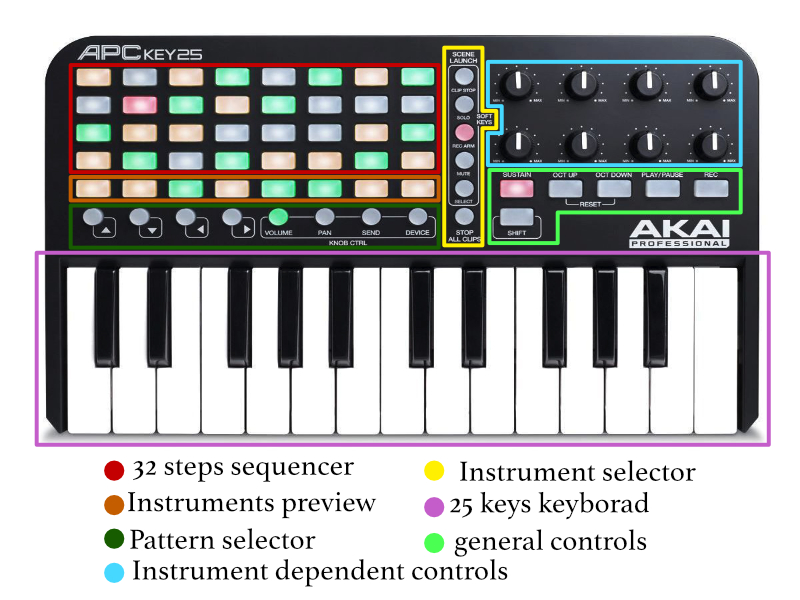

# STILL IN PROGRESS

## Turning the Akay APC key25 into a drum machine using pure data.

This project originated as an exam for the "MIDI and Computer Music Technology" course. 
The purpose is to create a pure data patch that was able to make the MIDI controller "Akay APC key25" into a real drum machine that could be used without the aid of the computer screen that houses the patch, but using the various lighted keys on the unit as visual input.

### The sounds
The Akay controller consists of:

* 40 rectangular buttons placed in an 8x5 matrix;
* 14 round buttons ;
* 8 knobs;
* 6 rectangular buttons below the knobs.
* A 25-key keyboard.

All these controls via the pure data patch become:

* A 32-step step sequencer, obtained from the first 4 rows of the rectangular button array.
* A row where individual instruments can be played;
* A pattern selector;
* Instrument selector;
* Modifiers for modifying individual instruments;
* General commands.

 

## How to use it.

Connect the keyboard to the computer, open the "main.pd" patch, and select the "dsp on" command on pure data.

Now everything is ready to play.

Select one of the instruments using the keys marked as `Instrument Selector` in the previous image. 
The first three are percussive sounds, in order we have Kick, Snare, HitHat, the fourth is a `?? ??` and they all work the same way. To insert or remove a note ON/OFF simply press on one of the buttons on the step sequencer and the corresponding LED will indicate whether the note has been added or removed.
The fifth sound is a synth bass, by default pressing on a sequencer button inserts an OFF note, to insert an ON+PITCH note you must hold down the corresponding key on the keyboard.

Once we have selected the sound and entered the sequence we can create more by changing patterns, to do this just press one of the buttons marked as `pattern selector` in the picture. 
There are 8 patterns for each sound.
To hear the pattern currently selected press the `PLAY/PAUSE` key. 
By default pattern #1 of each sound is played.
If no instrument is selected you will see in the sequencer area an LED indicating which step the sequence is at.
To hear a new pattern, first select the sound, then simultaneously press the `STOP ALL CLIPS` button and the button related to the pattern.
To delete the selected pattern press the `SUSTAIN` key.

When a sound is selected we can change some of its parameters using the 8 knobs. 
Each sound has a different number of parameters, but they all have in common the volume control positioned at the last knob, located in the bottom row all the way to the right.
To return to the default parameters press the `SHIFT` button.

### Sounds' Parameters
#### The Kick

1. Pitch
2. Tone
3. Attack
4. Decay
5. LowPass Filter Cutoff
6. Saturation
7. Empty
8. Volume

#### The Snare

1. Tune
2. Pitch
3. Decay
4. Noise
5. Saturation
6. Compression
7. LowPass Filter Cutoff
8. Volume

#### The HitHat

1. Attack
2. Decay
3. HiPass Filter Cutoff
4. Empty
5. Empty
6. Empty
7. Empty
8. Volume

#### The Bass

1. Attack
2. Hold
3. Decay
4. Drive
5. Chorus Amount
6. Chorus Mix
7. LowPass Filter Cutoff
8. Volume

### The effects 

####TO DO
1. BPM
2. EQ Low Frequencies
3. EQ Medium Frequencies
4. EQ High Frequencies
5. Compressor 
6. Glitch
7. -------
8. Volume

## The patch

### main.pd
This is the main patch that contains all the others.
First we notice the [softKeySelector] object, whose job is to return a number from 0 to 5 based on which instrument is selected by the user :
 
 * 0 = Effects
 * 1 = Kick
 * 2 = Snare
 * 3 = Hithat
 * 4 = -------------
 * 5 = Bass Synth

This number is passed to each instrument. 
When the instrument is selected you can use the knobs to change its parameters.
Percussive instruments receive a bang whenever they need to synthesize their sound. The bass synth, on the other hand, receives the number related to the note to be played following the MIDI protocol.

### sequencer.pd
This patch takes care of all the mechanics of the drum machine.
The heart of the sequencer is the [metro] object, which through the [pd counter] subpatch indicates which step of the sequence we are at. 
The step number goes into the [pd seqTrig] and [pd sequencerLight] subpatches.

##### pd seqTrig
Here, we are concerned with sending the outlet direct to the instruments, the information about when to synthesize their sound. 
It actually reads for each instrument one of the 8 arrays associated with it, and when we get to the penultimate step in the sequence it also takes care of changing the pattern to play if necessary.

##### pd sequencerLight
This subpatch completely takes care of the interface with the user.
Each subpatch inside takes care of a specific function:

* [pd instSelector]
As the name suggests it lights or turns off the LEDs assigned to the instrument selector when the instrument is selected.
* [pd stepIndicator]
When no instrument is selected this subpatch takes care of illuminating the current step in the sequence.
* [pd sequenceInterface]
When an instrument is selected this subpatch shows the selected pattern by lighting its LEDs.
* [pd seqNoteIn] Takes care of writing to the arrays and turning on/off the notes entered by the user.