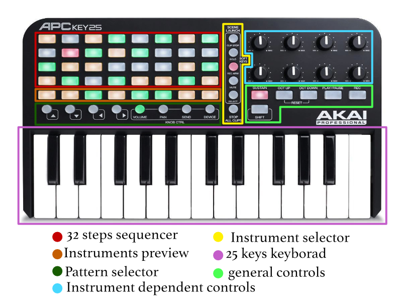

# DA FINIRE
# Trasformare una Akay APC key25 in una drum machine utilizzando pure data

Questo progetto nasce come un esame per il corso di "Tecnologie per il MIDI e la Computer Music". 
Lo scopo è quello di creare una patch pure data che fosse in grado di rendere il controller MIDI "Akay APC key25" in una vera e propria drum machine che potesse essere utilizzata senza l'ausilio dello schermo del computer che ospita la patch, ma utilizzando come input visivo i vari tasti luminosi presenti sull'unità.

---

## La drum machine in breve
Il controller Akay è composto da:

* 40 bottoni rettangolari posizionati in una matrice 8x5;
* 14 bottoni rotondi ;
* 8 manopole;
* 6 bottoni rettangolari al di sotto dei pomelli.
* Una tastiera da 25 tasti.

Tutti questi controlli tramite la patch pure data diventano:

* Uno step sequencer da 32 passi, ottenuto dalle prime 4 righe della matrice di bottoni rettangolari.
* Una riga dove poter suonare i singoli strumenti;
* Selettore di pattern;
* Selettore di strumenti;
* Modificatori per modificare i singoli strumenti;
* Comandi generali.

 

## Come utilizzarla
Collegare la tastiera al computer, aprire la patch "main.pd" e selezionare il comando "dsp on" su pure data.

Ora è tutto pronto per suonare.

Selezionare uno degli strumenti tramite i tasti segnati come `Instrument Selector` nell'imagine precedente. 
I primi tre sono suoni percussivi, in ordine abbiamo Kick, Snare, HitHat, il quarto è un `?? ??` e funzionano tutti allo stesso modo. Per inserire o togliere una nota ON/OFF basta premere su uno dei tasti dello step sequencer e il relativo led indicherà se la nota è stata aggiunta o eliminata.
Il quinto suono è un basso synth, di default premere su un bottone del sequencer inserisce una nota OFF, per inserire una nota ON+PITCH bisogna tenere premuto il corrispettivo tasto sulla tastiera.

Una volta selezionato il suono e inserita la sequenza possiamo crearne altre cambiando pattern, per farlo basta un dei tasti segnati come `pattern selector` nell'immagine. 
Ci sono 8 pattern per ogni suono.
Per sentire il pattern attualmente in modalità play pasta premere il tasto `PLAY/PAUSE`. Di default viene riprodotto il pattern #1 di ogni suono.
Se nessuno strumento è selezionato vedremo nell'area dedicata al sequencer un led che indica a quale step ci troviamo.
Per sentire un nuovo pattern, selezionare prima il suono poi contemporaneamente il tasto `STOP ALL CLIPS` e il tasto relativo al pattern.
Per eliminare l'intero pattern premere il tasto `SUSTAIN`.

Quando un suono è selezionato possiamo modificarne alcuni parametri tramite le 8 manopole. 
Ogni suono ha parametri diversi, ma tutti hanno in comune il comando del volume comandato dall'ultima manopola, posizionata nella fila in basso tutto a destra.
Per tornare ai parametri di default premere `SHIFT`.

### Parametri dei Suoni

#### Gran Cassa

1. Altezza
2. Tono
3. Attacco
4. Decadimento
5. Cutoff del Filtro Passa Basso
6. Saturazione
7. Vuoto
8. Volume

#### Rullante

1. Accordatura
2. Altezza
3. Decadimento
4. Rumore
5. Saturazione
6. Compressione
7. Cutoff del Filtro Passa Basso
8. Volume

#### Piatto HitHat

1. Attacco
2. Decadimento
3. Cutoff del Filtro Passa Alto
4. Random
5. Vuoto
6. Vuoto
7. Vuoto
8. Volume

#### Il basso

1. Attacco
2. Hold
3. Decadimento
4. Saturazione
5. Quantità di Chorus
6. Chorus Mix
7. Cutoff del Filtro Passa Basso
8. Volume

### Gli effetti

#### DA IMPLEMENTARE

1. BPM
2. EQ Basse Frequenze
3. EQ Medie Frequenze
4. EQ Alte Frequenze
5. Compressore 
6. Glitch
7. -------
8. Volume

## La patch

### main.pd
Questa è la patch principale che contiene tutte le altre.
Per prima cosa notiamo l'oggetto [softKeySelector], il cui compito è quello di restituire un numero da 0 a 5 in base a quale strumento è selezionato dall'utente :
 
 * 0 = Effetti
 * 1 = Gran cassa
 * 2 = Rullante
 * 3 = Piatto Hithat
 * 4 = -------------
 * 5 = Basso Synth

Questo numero viene passato ad ogni strumento. Quando lo strumento è selezionato si possono utilizzare i pomelli per modificarne i parametri.
Gli strumenti percussivi ricevono un bang ogni qual volta che devono sintetizzare il proprio suono. 
Il basso synth riceve invece il numero relativo alla nota da suonare seguendo il protocollo MIDI.
Tali bang e numeri vengono gestiti dall'oggetto [sequencer].

### sequencer.pd

Questa patch si occupa di tutta la meccanica della drum machine.
Il cuore del sequencer è l'oggetto [metro] che tramite la subpatch [pd counter] indica a quale passo della sequenza ci troviamo. 
Il numero del passo va nelle subpatch [pd seqTrig] e [pd sequencerLight].

##### pd seqTrig
Qui ci occupiamo di inviare all'outlet diretto agli strumenti l'informazione su quando sintetizzare il proprio suono. 
Di fatto legge per ogni strumento uno degli 8 array ad esso assogiato e quando arriviamo al penultimo passo della sequenza si occupa anche di cambiare il pattern da riprodurre se necessario.

##### pd sequencerLight
Questa subpatch si occcupa completamente dell'interfaccia con l'utente.
Ogni subpatch all'interno si occupa di una funzione specifica:

* [pd instSelector]
Come suggerisce il nome illumina o spenge i LED adibiti al selettore di strumento quando lo strumento viene selezionato.
* [pd stepIndicator]
Quando nessuno strumento è selezionato questa subpatch si occupa di illuminare lo step attuale della sequenza.
* [pd sequenceInterface]
Quando uno strumento è selezionato questa subpatch mostra il pattern selezionato accendendo i relativi LED. 
* [pd seqNoteIn] 
Si occupa di scrivere negli array e accandere/spegnere le note inserite dall'utente.